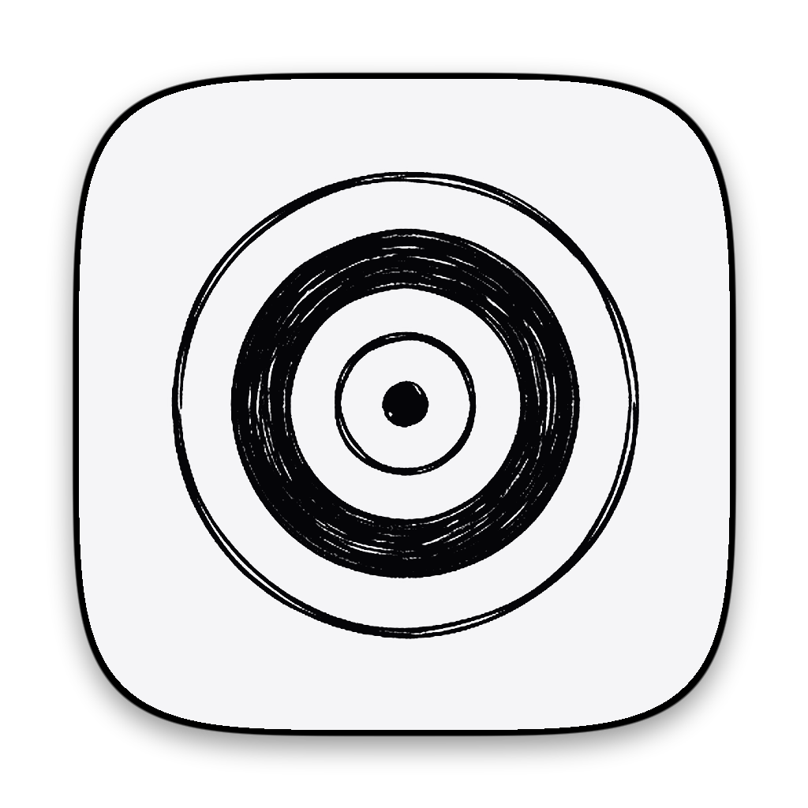

<div align="center">



# Foqz

**Spatial focus canvas, mission control, and local AI copilot for deep work.**

[](LICENSE)
[](#installation--downloads)
[](https://tldraw.dev)
[-purple.svg)](https://ollama.com)
[](#contributing)

[Download Releases](#installation--downloads) • [Features](#key-features) • [Roadmap](#roadmap) • [Quickstart](#development-setup) • [Architecture](#architecture--project-structure) • [Contributing](#contributing)

</div>

---

## What is Foqz?

Most productivity tools force your thoughts into rigid linear lists or endless database rows. Whiteboards give you infinite spatial freedom, but lack task tracking, timers, and execution workflows.

**Foqz** bridges this gap: a lightweight system tray desktop app that opens an infinite spatial canvas tailored specifically for deep work, task execution, pomodoro tracking, and local-first AI planning.

Lives quietly in your menu bar or system tray. Summon it instantly with `Cmd+Shift+F` (or `Ctrl+Shift+F`), brainstorm and structure your work, focus with built-in timers, and hide it when you are in the zone.

---

## Key Features

### 🎯 Spatial Focus Canvas
- Infinite zoomable whiteboard powered by `@tldraw/tldraw`.
- Freehand sketching, sticky notes, connectors, and spatial mapping designed for focus sessions.
- Multi-board support with clean spatial navigation.

### ⚡ Interactive Focus Task Cards
- High-contrast neo-brutalist cards with distinct status coloring.
- **1-Click Status Cycling**: Tap the pill to cycle between `Todo` ➔ `In Progress` ➔ `Done`.
- **Integrated Pomodoro Tracking**: Start a focus session directly from a card with live elapsed-time feedback.
- **Priority Indicator**: Visual priority dots to separate critical path items.
- **Markdown Notes & Checklists**: Expandable detail view for task notes and markdown checklists.
- **Quick-Spawn Connectors (`+`)**: One-click directional handle to instantly branch follow-up tasks and build execution trees.

### ⏱️ Visual Pomodoro & Session Timers
- Standalone canvas timers or embedded task timers.
- Visual countdowns and session feedback without context-switching between different timer apps.

### 🤖 Local AI Copilot (Powered by Ollama)
- **100% Local & Private**: Runs directly on your machine via Ollama. Zero cloud telemetry, zero subscription fees.
- **Slide-over Drawer**: Chat with your local LLM (e.g. `llama3.2`, `mistral`, `qwen2.5-coder`).
- **Canvas Spawner**: Turn AI-generated ideas and project breakdowns into structured task shapes positioned directly on your canvas with one click.

### ✨ Contextual Floating HUD
- Smart formatting bar docked dynamically below your active selection.
- Spring-animated accordion for typography, alignment, formatting, and color palettes.
- Auto-clamps to viewport edges with fluid CSS transitions.

### 🗂️ Spatial Project Frames & Workspaces
- Bounded frames to partition work visually and prevent mental overload.
- Workspace sidebar to quickly jump between active project areas and inspect task metrics.

### 🎛️ Specialized Productivity Shapes
- **Eisenhower Priority Grid**: 4-quadrant matrix (Urgent / Important) for rapid prioritization.
- **Kanban Swimlanes**: Horizontal flow columns for multi-stage work.
- **Quick Capture Inbox**: Dump thoughts rapidly before organizing.
- **Visual Timelines**: Chronological visual scheduling on the board.
- **Energy Tracker & Reflection Logs**: Track energy levels throughout the day and capture end-of-day reflections.

### 🛎️ Native System Tray / Menu Bar Integration
- Custom 2-tone template icon designed specifically for macOS dark and light menu bars.
- Global summon hotkey (`Cmd+Shift+F` on macOS, `Ctrl+Shift+F` on Windows/Linux).
- Auto-centering window, configurable always-on-top mode, and launch-at-login support.

### 🔒 Local-First & 100% Private
- All boards, settings, and timers are saved locally as standard JSON files in your OS application data folder.
- Fully operational completely offline.

---

## Installation & Downloads

Pre-built binaries are available on the [GitHub Releases](https://github.com/yhauxell/foqz/releases) page:

| Platform | Format | Architecture |
| :--- | :--- | :--- |
| **macOS** | `.dmg`, `.zip` | Universal (Apple Silicon & Intel) |
| **Windows** | `.exe` (NSIS Installer) | x64 |
| **Linux** | `.AppImage` | x64 |

---

## Development Setup

### Prerequisites

- **Node.js** >= 18.0.0
- **Yarn** v1 (`npm install -g yarn`)
- *(Optional for AI Copilot)* **[Ollama](https://ollama.com/)** running locally

### 1. Clone & Install

```bash
git clone https://github.com/yhauxell/foqz.git
cd foqz
yarn install
```

### 2. Run in Development Mode

Launches Vite dev server with Hot Module Replacement (HMR) and spawns the Electron shell:

```bash
yarn dev
```

### 3. Build & Package

To build the production web renderer and launch the Electron shell locally:

```bash
yarn build
yarn start
```

To package native desktop installers for your operating system:

```bash
# Package for your current OS (output in ./release)
yarn dist

# Unpacked directory build (useful for quick local inspection)
yarn dist:dir
```

### 4. Landing Page Preview

Foqz includes a dedicated web landing page showcasing the app:

```bash
yarn dev:landing
```

---

## Local AI Copilot Setup (Ollama)

Foqz connects to a local Ollama instance without requiring any API keys or external services:

1. Download and install [Ollama](https://ollama.com).
2. Pull your preferred model in your terminal:
   ```bash
   ollama run llama3.2
   # or: ollama run mistral
   # or: ollama run qwen2.5-coder
   ```
3. In Foqz, open the **Copilot Drawer** (Sparkles icon or `C` shortcut) or go to **Settings (⚙️) ➔ Copilot**.
4. Set your Ollama endpoint (default: `http://127.0.0.1:11434`) and select your active model from the dropdown.

---

## Keyboard Shortcuts

| Shortcut | Action |
| :--- | :--- |
| `Cmd + Shift + F` / `Ctrl + Shift + F` | **Toggle Foqz window** (global shortcut) |
| `Space + Drag` | Pan across canvas |
| `Cmd / Ctrl + Scroll` | Zoom in / out |
| `Cmd / Ctrl + 0` | Reset zoom to 100% |
| `Cmd / Ctrl + 1` | Zoom to fit content |
| `T` | Select Focus Task Card tool |
| `P` | Select Project Frame tool |
| `Backspace` / `Delete` | Delete selected shapes |
| `Cmd / Ctrl + Z` | Undo |
| `Cmd / Ctrl + Shift + Z` | Redo |
| `Esc` | Clear selection / close modal |

---

## Architecture & Project Structure

```
foqz/
├── electron/                 # Electron main process & preload IPC scripts
│   ├── main.cjs              # Window management, tray creation, native menus, shortcuts
│   └── preload.cjs           # ContextBridge API exposing secure disk & app hooks
├── electron-assets/          # App branding, .icns, .png icons, and 2-tone tray templates
├── src/
│   ├── components/           # React UI components & canvas overlays
│   │   ├── ContextualSelectionHud.tsx  # Floating spring-animated formatting bar
│   │   ├── CopilotDrawer.tsx           # AI copilot slide-over chat & spawner
│   │   ├── FocusSettings.tsx           # App preferences, hotkeys, and Ollama settings
│   │   ├── FocusToolbar.tsx            # Floating canvas toolbar
│   │   ├── TopbarBoardMenu.tsx         # Multi-board selector & board management
│   │   └── WorkspaceSidebar.tsx        # Spatial project navigation & metrics
│   ├── shapes/               # Custom tldraw shape definitions & tools
│   │   ├── focusTask/        # Interactive task card shape util & tool
│   │   ├── focusTimer/       # Canvas Pomodoro timer shape util & tool
│   │   ├── projectFrame/     # Spatial boundary frames
│   │   ├── focusPriorityGrid/# Eisenhower 4-quadrant matrix
│   │   ├── focusSwimlane/    # Kanban swimlane shape
│   │   ├── focusInbox/       # Fast idea capture inbox
│   │   ├── focusTimeline/    # Chronological planning timeline
│   │   ├── focusEnergy/      # Energy level tracking shape
│   │   └── focusReflection/  # End-of-day reflection block
│   ├── lib/                  # Utilities, storage logic, and AI helpers
│   │   ├── canvasSpawner.ts  # Programmatic shape generation from AI responses
│   │   ├── ollama.ts         # Local Ollama client & streaming parser
│   │   ├── appSettings.ts    # Settings schema & default values
│   │   └── focusTime.ts      # Pomodoro timer math & session utilities
│   ├── landing/              # Web landing page & release download links
│   ├── FocusCanvasApp.tsx    # Primary canvas container and UI orchestrator
│   └── styles.css            # Tailwind CSS v4 styling & theme tokens
└── scripts/                  # Helper scripts (macOS icon generation, landing sync)
```

---

## Data Storage & Local Persistence

Foqz stores board snapshots and user preferences as local JSON files. No external databases, no proprietary binary formats.

- **macOS**: `~/Library/Application Support/foqz/board-snapshot.json`
- **Windows**: `%APPDATA%\foqz\board-snapshot.json`
- **Linux**: `~/.config/foqz/board-snapshot.json`

Because snapshots are clean JSON, you can easily back them up, sync them via your own tools (Git, Syncthing, Dropbox), or version-control your workspaces.

---

## Roadmap

Active development milestones and proposed features are tracked through our [GitHub Issues](https://github.com/yhauxell/foqz/issues?q=is%3Aissue+label%3Aroadmap). Current priority items:

- [ ] [**#2**: Detect and auto-configure running local LLM servers](https://github.com/yhauxell/foqz/issues/2) (Ollama, LM Studio, llama.cpp, LocalAI)
- [ ] [**#3**: Support Model Context Protocol (MCP) integrations](https://github.com/yhauxell/foqz/issues/3) for local tools & environment context
- [ ] [**#4**: Improve spatial layout algorithms and ordering for generated canvas elements](https://github.com/yhauxell/foqz/issues/4)
- [ ] [**#5**: Support custom SKILLs and AGENT.md configuration profiles](https://github.com/yhauxell/foqz/issues/5)
- [ ] [**#6**: Project-scoped AI context and spatial frame awareness](https://github.com/yhauxell/foqz/issues/6)

---

## Contributing

We love contributions! Foqz is an open-source project built for the community. Whether you're fixing a bug, designing a new focus shape, or improving documentation, here's how to get involved:

1. **Fork the repository** on GitHub.
2. **Create a feature branch**:
   ```bash
   git checkout -b feat/my-new-feature
   ```
3. **Make your changes** and verify the build:
   ```bash
   yarn build
   ```
4. **Commit using semantic commit messages**:
   - `feat(...)`: New feature or capability
   - `fix(...)`: Bug fix
   - `docs(...)`: Documentation updates
   - `refactor(...)`: Code refactoring without behavioral changes
   - `style(...)`: Formatting or styling improvements
5. **Push to your fork and submit a Pull Request**.

Please ensure your changes adhere to standard TypeScript practices and maintain clean separation of concerns between Electron IPC, tldraw shape utilities, and React components.

---

## License

Foqz is open-source software licensed under the [MIT License](LICENSE).
