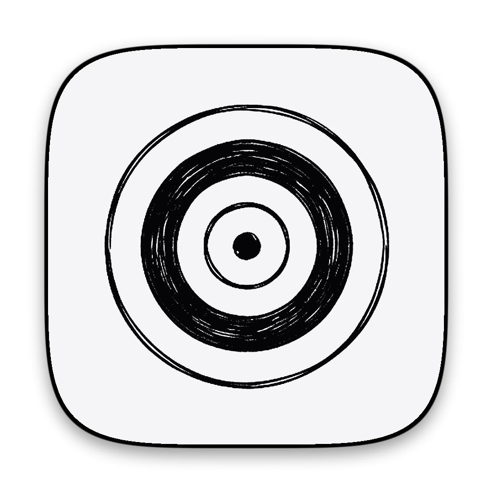

<div align="center">



# Foqz

**Spatial focus canvas, mission control, and local AI copilot for deep work.**

[](LICENSE)
[](#installation--downloads)
[](https://reactflow.dev)
[-purple.svg)](https://ollama.com)

[Download Releases](#installation--downloads) • [Features](#key-features) • [Roadmap](#roadmap) • [Quickstart](#development-setup) • [Architecture](#architecture--project-structure)

</div>

---

## What is Foqz?

Most productivity tools force your thoughts into rigid linear lists or endless database rows. Whiteboards give you spatial freedom, but lack task tracking, timers, and execution workflows.

**Foqz** bridges this gap: a lightweight Electron desktop app that opens an infinite spatial canvas tailored specifically for deep work, task execution, and local-first AI planning. It lives quietly in your menu bar or system tray — summon it instantly with `Cmd+Shift+F`, structure your work on the canvas, lock into a focus session, and hide it when you're in the zone.

---

## Key Features

### 🎯 Spatial Focus Canvas
- Infinite, zoomable canvas powered by **React Flow** (`@xyflow/react`).
- Tactile **Paper Sticky Notes** with organic corners, fold styles, paper noise textures, tape/pin details, and multiple pastel color variants.
- Freehand pencil drawing with pressure simulation via **perfect-freehand**.
- Sketch-style boxes and circles rendered with **Rough.js** for a hand-drawn aesthetic.
- Draggable, resizable Project Frames for partitioning work spatially.
- Smart node re-parenting: drag a task out of a project frame and confirm to move it to the root canvas.
- **Quick Center** action on the node toolbar to instantly snap the viewport to any selected element.
- High-performance rendering with viewport culling, scoped timer subscriptions, atomic SVG rendering, and throttled cursor tracking.

### ⚡ Focus Task Cards
- Compact cards with editable title, rich markdown notes (rendered via **marked**), and inline checklists.
- Priority cycling (P1 Urgent → P2 High → P3 Normal → P4 Low) with color-coded indicators.
- Status tracking (open / doing / done) with one-click toggle.
- Fully dark-mode aware with distinct paper themes (cream, fog, sage, bloom).

### 🔒 Mono Focus Mode (Deep Work Lock)
- Lock the canvas to a single task with a full-screen dimmed overlay.
- Integrated 25-minute countdown timer with pause, extend, and reset controls.
- **AI-powered exit friction**: when you try to escape early, you must justify the context switch. Jev (TypeSafe) evaluates whether the reason is legitimate or an impulse and pushes back with feedback when needed.
- Hold `Esc` for 3 seconds to force-unlock if truly necessary.

### 🤖 Spatial AI Copilot & Agent System
- **Element Inline Chat**: a floating, draggable chat panel anchored contextually next to any selected node or the whole canvas.
- **Full Agent Loop & Native Tools**: autonomous multi-step tool calls for spawning tasks, spawning sticky notes, updating nodes, decomposing tasks into subtask trees (`expand_task`), and triaging candidate items.
- **Stop Execution Controls**: cancel active agent loops and tool execution runs cleanly at any moment via UI controls or `Esc`.
- **Project AGENT.md Persona Profiles**: load custom instructions, persona profiles, and skills per project frame, with automated discovery and syncing directly from connected GitHub repositories.
- **AI Copilot Drawer**: full slide-over chat with canvas-spawn capabilities — turn AI responses into task nodes placed directly on the board.
- **MCP Integration**: connect external tools via the Model Context Protocol. The GitHub MCP server is built-in; additional servers can be configured in Settings.
- Supports **Ollama** (local, 100% private) and **external AI providers** (OpenAI, Gemini, OpenRouter, and OpenAI-compatible endpoints) configurable via Settings → AI.
- Space-aware prompts: the AI is given context about the active node type, its text, its containing project, and the full canvas state.

### 🔍 Global Spotlight (`Cmd+K`)
- Search, navigate, and **create** canvas elements from a single keyboard-first command bar.
- Fuzzy search across all nodes on the canvas.
- Prefix command actions: `/note` for fast sticky note creation, `/sweep` to collect free items into an inbox frame.
- Quick-create actions for Task, Sticky Note, Project, Box, Text, and Circle nodes.
- AI prioritization mode: describe your goal for the day and let TypeSafe Jev rank, score, and surface the most relevant tasks.

### 🗂️ Project Frames & Connectors
- Visual boundary frames to group related tasks spatially.
- Per-project **connectors**: link a GitHub repository, Sentry project, Notion workspace, or custom MCP servers.
- Context tab for attaching free-form project notes or syncing a GitHub README as project context for the AI.
- Dedicated **Agent Persona tab** to configure or sync custom `AGENT.md` instructions and behavior per project.

### 🖥️ Window Management & macOS Desktop Spaces
- Dedicated maximize / restore controls in the header bar and native macOS traffic lights support.
- Full screen Desktop Space transition support (`Cmd+Ctrl+F` or `F11`).
- Double-click the topbar to quickly toggle maximized state.

### 🛫 Today's Runway & Flight Strips
- **Dedicated `runwayFrame` Entity**: separate from generic project containers, purpose-built for daily execution and WIP limiting.
- **Deep Work Framework Templates**:
  - **The Rule of 3**: 3 high-impact outcomes for the day (Chris Bailey / J.D. Meier).
  - **90-Minute Ultradian Sprint**: 2 core deep-work focus blocks based on natural ultradian rhythm cycles.
  - **Critical Path / Blocker Chain**: 4 sequential prerequisite steps for unblocking mission-critical work.
  - **15-Minute Rapid Batch**: 5 quick-burst administrative or triage micro-tasks.
- **Task Provenance & Origin Memory**: dragging a task into a Runway records its `originProjectId`, `originProjectTitle`, `originProjectAccent`, and original board position. Clicking `[● Project Name ↗]` flies camera directly to the project, while project metrics preserve total backlog counts. A 1-click **Return to Project** action snaps completed or deferred tasks right back home.
- **Compact Flight Strips (~48px)**: tasks staged in a runway transform into low-profile strips with blocker status (`⛔ Blocked` / `🟢 Ready`), quick timer trigger, origin badge, and instant status toggling.

### 🛣️ Waypoint Rail (Left Dock)
- **Distinct Runway & Project Waypoints**:
  - **Runways Section**: squircle icons with template flight glyphs, active sprint indicators, and a dedicated `+` popover to spin up new framework-based runways.
  - **Projects Section**: circle icons with project monograms and accent colors, plus `+` project button.
  - **Notification-Style Completed Badges**: counter badges showing completed items (`2`, `5`, or `✓` when fully cleared) without cluttering pending tasks.
  - Click any squircle or circle to fly camera smoothly to that spatial zone (`⌘0` / Space+1 to fit all).

### ⌨️ Keyboard Shortcuts
| Shortcut | Action |
| :--- | :--- |
| `Cmd+Shift+F` / `Ctrl+Shift+F` | Toggle Foqz window (global) |
| `Cmd+K` / `Ctrl+K` | Open Global Spotlight (`/note`, `/sweep`) |
| `Cmd+J` / `Ctrl+J` / `C` | Open In-Canvas AI Chat (on node or canvas) |
| `Cmd+B` / `Ctrl+B` / `0` | Fit view (zoom to all content) |
| `Cmd+Ctrl+F` / `F11` | Maximize / restore window |
| `V` / `1` | Select / pointer / pan tool |
| `N` / `Cmd+N` | New Task card |
| `S` | New Paper Sticky Note |
| `B` / `2` | Box tool |
| `O` | Circle tool |
| `T` / `3` | Text note tool |
| `A` / `4` | Arrow / connector tool |
| `P` / `5` / `D` | Pencil / freehand tool |
| `Cmd+Shift+P` | New Project Frame |
| `Shift+C` | Center camera on selected element and bring to front |
| `F` | Lock into Focus Mode (on selected task) |
| `Backspace` / `Delete` | Delete selected element |
| `Cmd+D` / `Ctrl+D` | Duplicate selected |
| `Cmd+Z` / `Ctrl+Z` | Undo |
| `Cmd+Shift+Z` / `Ctrl+Y` | Redo |
| `?` | Toggle keyboard shortcuts cheatsheet |
| `Esc` | Stop agent execution / clear selection / cancel tool |

### 🛎️ Native System Tray / Menu Bar
- 2-tone template icon designed for macOS dark and light menu bars.
- Global summon hotkey.
- Auto-centering window, always-on-top mode, launch-at-login support.
- Native app menus with keyboard shortcuts for Undo, Preferences, and Check for Updates.

### 🔒 Local-First & Private
- All boards and settings saved locally as standard JSON in your OS application data folder.
- No accounts, no telemetry, no internet required to use core features.

---

## Installation & Downloads

Pre-built binaries are available on the [GitHub Releases](https://github.com/yhauxell/foqz/releases) page:

| Platform | Format | Architecture |
| :--- | :--- | :--- |
| **macOS** | `.dmg`, `.zip` | Universal (Apple Silicon & Intel) |
| **Windows** | `.exe` (NSIS Installer) | x64 |
| **Linux** | `.AppImage` | x64 |

### 🍎 macOS Installation Note (Gatekeeper)

Because Foqz is not yet signed with a paid Apple Developer ID certificate, macOS Gatekeeper may flag downloaded binaries with:
> *"Foqz is damaged and can't be opened. You should move it to the Trash."*

The app is completely intact and safe. To open it:

1. Drag `Foqz.app` into `/Applications`.
2. Run this one-time command in Terminal to clear the quarantine attribute:
   ```bash
   xattr -cr /Applications/Foqz.app
   ```
3. **Alternative**: Go to **System Settings → Privacy & Security** and click **"Open Anyway"**.

> [!TIP]
> **Windows Users**: On first launch, Windows SmartScreen may show an *"Unknown Publisher"* prompt. Click **More info → Run anyway**.

---

## Development Setup

### Prerequisites

- **Node.js** >= 18.0.0
- **Yarn** v1 (`npm install -g yarn`)
- *(Optional — for local AI)* **[Ollama](https://ollama.com/)** running locally

### 1. Clone & Install

```bash
git clone https://github.com/yhauxell/foqz.git
cd foqz
yarn install
```

### 2. Run in Development Mode

Launches the Vite dev server with HMR and spawns the Electron shell:

```bash
yarn dev
```

### 3. Build & Package

```bash
# Build the production web renderer only
yarn build

# Build + launch the Electron shell locally
yarn build && yarn start

# Package native desktop installers for your current OS (output: ./release)
yarn dist

# Unpacked directory build (useful for quick local inspection)
yarn dist:dir
```

### 4. Visual & Interaction Testing

Foqz includes Playwright integration for automated visual regression and interactive testing across both the Web renderer and native Electron desktop shell:

```bash
# Run all end-to-end tests (Web renderer & Electron native window)
npm run test:e2e

# Run only the fast Web renderer canvas & modal suite
npx playwright test --project=renderer

# Run only native Electron desktop tests
npx playwright test --project=electron

# Start live interactive development with Chrome DevTools Protocol (CDP port 9222)
npm run dev:debug

# Drive live interactions or capture visual snapshots on-demand
node scripts/live-interact.mjs screenshot my-feature
node scripts/live-interact.mjs click "button[aria-label='Settings']"
```

> **AI Agent Skill**: Automated visual and interaction testing is codified in [`.agents/skills/visual-interaction-testing/SKILL.md`](.agents/skills/visual-interaction-testing/SKILL.md) for autonomous feature verification.

### 5. Landing Page Preview

```bash
yarn dev:landing
```

---

## Local AI Setup (Ollama)

Foqz connects to a local Ollama instance with zero API keys or external services:

1. Download and install [Ollama](https://ollama.com).
2. Pull a model:
   ```bash
   ollama pull llama3.2
   # or: ollama pull qwen2.5-coder
   # or: ollama pull mistral
   ```
3. In Foqz, open **Settings (⚙️) → AI** and set your Ollama endpoint (default: `http://127.0.0.1:11434`), then select your active model.

You can also configure external AI providers (e.g. OpenAI-compatible APIs) from the same Settings panel.

---

## Architecture & Project Structure

```
foqz/
├── electron/                   # Electron main process & preload IPC
│   ├── main.cjs                # Window management, tray, native menus, global shortcuts, auto-updater
│   └── preload.cjs             # ContextBridge API exposing secure disk & app hooks
├── electron-assets/            # App icons (.icns, .png, 2-tone macOS tray templates)
├── src/
│   ├── poc/                    # Spatial canvas (React Flow)
│   │   ├── FlowCanvas.tsx      # Main canvas component — nodes, edges, tools, shortcuts
│   │   ├── FlowCanvasAppWrapper.tsx  # ReactFlowProvider wrapper
│   │   ├── nodes/              # Custom node renderers
│   │   │   ├── FocusTaskNode.tsx     # Task card with timer, priority, notes
│   │   │   ├── NoteNode.tsx          # Tactile paper sticky note (colors, folds, noise)
│   │   │   ├── ProjectFrameNode.tsx  # Resizable project boundary frame
│   │   │   ├── BoxNode.tsx           # Rough.js sketch-style box
│   │   │   ├── CircleNode.tsx        # Rough.js sketch-style circle
│   │   │   ├── TextNode.tsx          # Inline editable text node
│   │   │   └── PencilNode.tsx        # Freehand stroke node (perfect-freehand)
│   │   ├── edges/              # Custom edge (connector) renderers
│   │   ├── components/
│   │   │   ├── FlowShapeMenu.tsx     # Floating node toolbar (color, border, center, delete)
│   │   │   ├── FlowZoomControls.tsx  # Zoom in/out/fit controls
│   │   │   ├── ReparentConfirmModal.tsx  # Confirm drag-out-of-project re-parenting
│   │   │   └── ShortcutsModal.tsx    # Keyboard shortcuts cheatsheet overlay
│   │   ├── store/
│   │   │   └── flowCanvasStore.ts    # Zustand + Zundo store (nodes, edges, undo/redo, persistence)
│   │   ├── hooks/
│   │   │   └── useFlowCanvasShortcuts.ts  # Hotkey bindings via react-hotkeys-hook
│   │   └── shortcuts/          # Shortcut definitions & config
│   ├── components/             # App-level React UI components
│   │   ├── ElementInlineChat.tsx      # Floating, draggable per-node AI chat panel
│   │   ├── CopilotDrawer.tsx          # Full slide-over AI copilot with canvas spawner
│   │   ├── MonoFocusController.tsx    # Deep work lock-in overlay with timer & AI exit friction
│   │   ├── GlobalSpotlight.tsx        # Cmd+K command palette for search & creation (/note, /sweep)
│   │   ├── ProjectConnectorsModal.tsx # Per-project connectors & AGENT.md persona config
│   │   ├── WaypointRail.tsx           # Spatial bookmark rail
│   │   ├── TopbarBoardMenu.tsx        # Board selector & management
│   │   ├── FocusSettings.tsx          # App preferences (AI, MCP, theme, working hours)
│   │   └── WorkspaceSidebar.tsx       # Spatial navigation & task metrics (legacy)
│   ├── lib/                    # Utilities & AI helpers
│   │   ├── canvasSpawner.ts    # Programmatic node generation from AI responses
│   │   ├── canvasTools.ts      # Native Foqz agent tools (spawn, update, expand, triage)
│   │   ├── mcpAgentLoop.ts     # Multi-turn tool execution loop with abort/cancellation
│   │   ├── agentProfiles.ts    # AGENT.md markdown parser & prompt templates
│   │   ├── githubAgentSync.ts  # GitHub repo AGENT.md discovery & sync
│   │   ├── canvasContext.ts    # Builds spatial context payload for AI prompts
│   │   ├── ollama.ts           # Ollama client & streaming parser
│   │   ├── jev.ts              # TypeSafe/Jev integration for AI evaluations
│   │   ├── mcp.ts              # MCP client management & tool dispatch
│   │   └── appSettings.ts      # Settings schema, defaults & persistence
│   ├── context/                # React contexts (settings, focus app state)
│   ├── types/                  # Shared TypeScript type definitions
│   ├── FocusCanvasApp.tsx      # Root app component & event bus orchestration
│   └── styles.css              # Tailwind CSS v4 global styles & theme tokens
├── landing/                    # Web landing page source
└── scripts/                    # Helper scripts (icon generation, landing sync)
```

---

## Tech Stack

| Category | Library / Tool |
| :--- | :--- |
| **Desktop Shell** | Electron 35 |
| **Renderer Framework** | React 18 + TypeScript 6 |
| **Canvas** | React Flow (`@xyflow/react` v12) |
| **State Management** | Zustand + Zundo (undo/redo middleware) |
| **Styling** | Tailwind CSS v4 + shadcn/ui components |
| **Freehand Drawing** | perfect-freehand |
| **Sketch Graphics** | Rough.js |
| **AI Runtime** | Ollama (local) + configurable external providers |
| **AI Evaluations** | TypeSafe / Jev |
| **MCP** | `@modelcontextprotocol/sdk` |
| **Hotkeys** | react-hotkeys-hook |
| **Icons** | Lucide React |
| **Markdown** | marked + DOMPurify |
| **Build** | Vite 5 + electron-builder |
| **Fonts** | Geist (variable), Caveat, Shantell Sans |

---

## Data Storage & Persistence

Foqz stores board snapshots and settings as local JSON via Electron's `localStorage` bridge and the OS application data folder. No external databases, no binary formats.

- **macOS**: `~/Library/Application Support/foqz/`
- **Windows**: `%APPDATA%\foqz\`
- **Linux**: `~/.config/foqz/`

Snapshots are clean JSON — back them up, sync with Syncthing, Dropbox, or version-control your workspaces however you like.

---

## Roadmap

Active milestones are tracked in [GitHub Issues](https://github.com/yhauxell/foqz/issues?q=is%3Aissue+label%3Aroadmap):

- [ ] Auto-detect running local LLM servers (Ollama, LM Studio, llama.cpp, LocalAI)
- [ ] Improved spatial layout algorithms for AI-generated canvas elements
- [x] Custom SKILL and AGENT.md configuration profiles for the AI copilot
- [x] Native window maximization and macOS Desktop Spaces support
- [x] Autonomous agent loop with native canvas tools and cancel/abort execution controls
- [ ] Deeper project-scoped AI context and cross-node awareness
- [ ] Canvas collaboration / sync via local network or self-hosted backend

---

## License

Foqz is source-available software licensed under the **[Business Source License 1.1](LICENSE)**.

**You are free to:**
- Use Foqz for personal, non-commercial purposes.
- Modify and build from source for personal use.
- Redistribute for non-commercial purposes with attribution.

**You may NOT:**
- Use Foqz as part of a commercial product or service.
- Offer Foqz (or a derivative) as a paid or monetized tool.
- Use it internally within a for-profit organization.

The license automatically converts to **MIT** on **January 1, 2029**.

For commercial licensing inquiries: **foqz@yhauxell.com**
